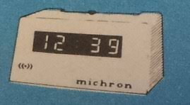

### Flip clock

Electro-mechanical flip clocks are one of those "retro" electronic items sold on Etsy, and there are also modern reproductions. Although electro-mechanical "digital" clocks, i.e. those showing the time with digits rather than hands, were first seen in public spaces in the 1930s they only became a common domestic item in the 1970s. Through the 1970s electro-mechanical alarm clocks developed rapidly from clocks with numbers on wheels to flip clocks and then to "solid state" clocks using integrated circuits and seven segment LED displays. In most cases these digital clocks were alarm clocks on a bedside table.

I really don't know if most people even have a bedside alarm clock these days, though I suspect not since mobile phones have had this capability for two decades or more. Anyway, I'm not most people and I've had a bedside alarm clock of one kind or another my whole life.  My first would have been a kit built Maplin digital alarm clock with four red LED digits that was one of the first electronic projects I ever built, I would have been 10 years old. 

